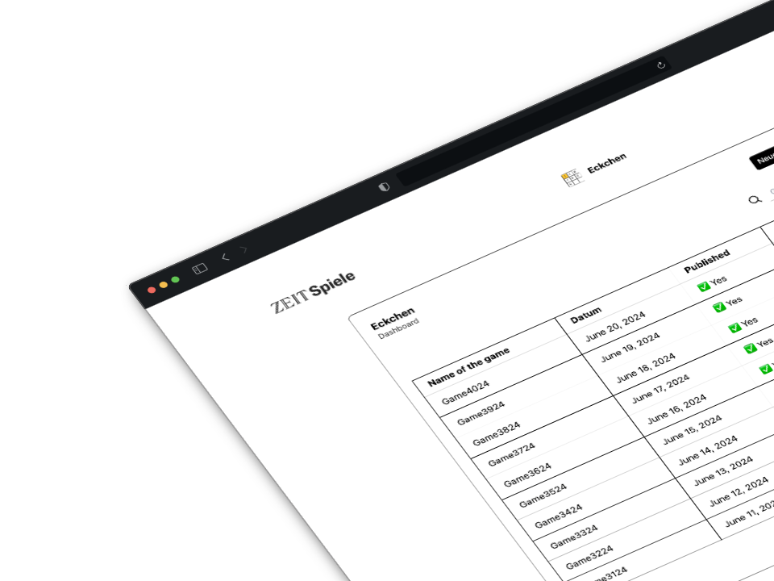

<div align="center">

<a target="_blank" href="https://github.com/ZeitOnline/svelte-superforms-backoffice">
  
</a>

<div>

# Game Admin Interface


</div>


[Repo](https://github.com/ZeitOnline/svelte-superforms-backoffice)
|
[Figma](https://www.figma.com/design/3Dz9yV5vMb9bORSvQQkw8Q/Backoffice---Designs?node-id=6-59&t=iYY5z1KsRiPfrMBo-0)

</div>

## Features

- 🛠️ Modern Admin Interface created with Svelte5 and SvelteKit
- 🏡 Create new games (also through csv upload), edit the existing ones, delete them! You have full control!
- 📝 [Superforms](https://superforms.rocks/) is used to handle validation with the forms
- 🎨 Styling created using TailwindCSS and [Zeit Design System](https://npmjs.com/package/@zeitonline/design-system)
- ⌨️ 100% written in TypeScript
- 💻 Reach local the server easily with postqREST
- 🧪 Test using vitest and svelte testing library
- 🎁 ...much more

## Description of the project

Following the modus operandi of other games, it was decided that eckchen needed a new admin interface where people could easily update information regarding the games. The project is managed by the team Engagement and Games.

## What needs to be changed for a new game?

Since we started with `eckchen`, you will see many pieces of code that have to do with that game, like the `schemas` for zod or the elements in the ui, like the ones you will find in `GameTable.svelte`.

Here you will see a list of the files that you will surely need to edit:

```md
src
├── lib
│   ├── error-messages.ts // the error messages for the form validation
│   ├── queries.ts // all the queries that will be used with the postqres
├── components
│   ├── GameTable.svelte // the main component used for Create and Edit
│   ├── Header.svelte // you will need to replace the EckchenLogo.svelte
│   ├── ... // other components probably will need some change
├── schemas
│   ├── generate-game.ts // define all the schemas for the forms (validation, types, etc.)
└── app.html // change the name of the game
```

## Requirements

- Node.js
- nvm
- npm

## Setup

1. Clone the repo
2. Run `nvm use` to install the latest lts version
3. Run `npm i --force` to install the required packages. As soon as Svelte 5 will become stable, we will not need --force.
4. Run `npm run dev` to start the dev server

## Test

You can run some tests by using the following commands:

1. `npm run test:unit` to run all the unit tests.

## To Dos

Check the main task on [Jira](https://zeit-online.atlassian.net/browse/ZO-5839) for further information.

- [ ] Implement the Microsoft Authentication
- [x] POST game (works but the id generation is manually done instead of through the db). Here we have the problem that when we submit the game, we are sending one only request to create the game and the questions (not yet the game_state). Since we cannot create the questions without the game_id, that is why we do the id generation manually. However, we might need to refactor to do 2 requests.
- [x] POST questions
- [x] Validation is required (for the moment, we can create games without questions)
- [x] PATCH game and questions do not work as expected (they are creating instead of UPSERT) and you need to update the page to make it work.
- [x] We have used superform in NewGameView.svelte in two forms. Do we need it also when updating game and deleting?
- [ ] DELETE game with CASCADE of the game_question and game_state
- [ ] Tests for the different views need to be written.
- [x] beforeleave message (when clicking back in theb browser oder zueruck in the buttons so that user does not lose information if there was)
- [ ] adr (pr started)

## Test To Dos

### unit
- [ ] csv upload
- [ ] serializeRow()
- [ ] addCustomDate()
- [ ] onUpdate (form.name and form.release_date - for create and edit)
- [ ] createGame (game and game_question[])
- [ ] editGame (game and game_question[])
- [ ] deleteGame

stretch:
- [ ] tainted warning message
- [ ] search in the dashboard

### e2e
- [ ] create flow (do we need it?)
- [ ] flow with tainted warning message (confirm())
